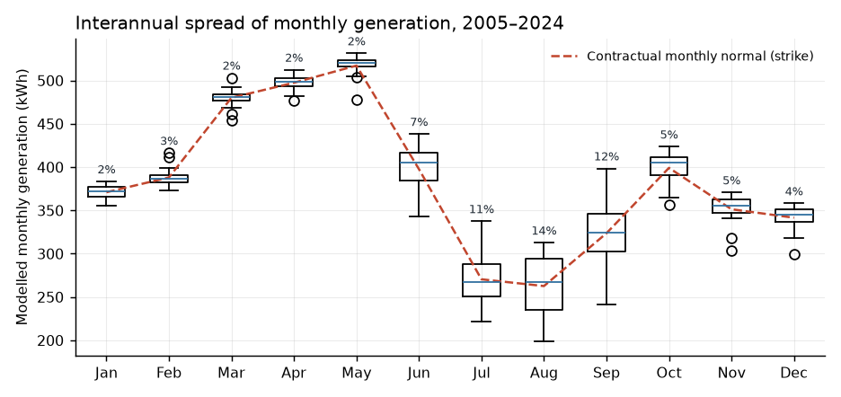
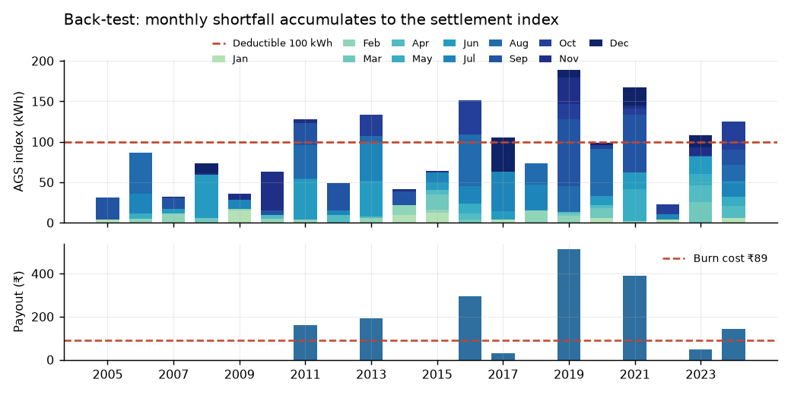

# Parametric Cover for Rooftop Solar Generation Shortfall

**Location:** Pincode 380006 (Ellisbridge, Ahmedabad) · **Data:** ERA5-Land daily, 2005–2024 · **System:** 3 kVA, PR 80%, AEP50 4,600 kWh, tariff ₹5.75/kWh

---

## 0. Approach in one paragraph

I converted the weather record into a *modelled generation* series using a fixed, published PV equation, calibrated so that its 20-year mean equals the contractual AEP50 of 4,600 kWh. The policy then settles on a shortfall measured in kWh against that same number the customer was sold, which keeps the index in the customer's own units and removes an entire class of "why is my payout in W/m²?" disputes. The decisive empirical finding is that **annual solar resource at this site is remarkably stable — CV of 1.8%** — so a conventional annual index is uninsurable, and the product has to be built on *monthly* shortfalls accumulated without netting. Pricing is done twice: an empirical burn cost, and a Monte Carlo with an explicit variance-inflation adjustment because a 9 km reanalysis grid understates true point variability.

**Data quality.** 7,305 daily records, zero missing dates, zero nulls, zero duplicates, no negative or physically implausible SSRD values, temperature range 13.6–37.8 °C. No gap-filling was required.

---

## 1. Task 1 — Weather index selection

**Selected variable: surface solar radiation downwards (SSRD / GHI), with 2 m air temperature as a secondary correction.**

A PV system's output is, to first order, a linear function of the irradiance reaching the plane of the array, de-rated by cell temperature. I therefore screened candidate ERA5-Land variables against *de-seasonalised* monthly generation anomalies — removing the shared annual cycle, since any seasonal variable will look predictive if you leave it in.

| Candidate variable | Pearson r | R² | Generation variance left unexplained |
|---|---|---|---|
| **GHI (SSRD)** | **0.997** | **0.993** | **0.7%** |
| Rain-day count (>1 mm) | −0.682 | 0.465 | 53.5% |
| Total precipitation | −0.540 | 0.291 | 70.9% |
| Mean temperature | 0.211 | 0.044 | 95.6% |

**Why GHI.** It is the physical driver, not a correlate. Cloud, aerosol, haze and dust in the atmospheric column all act on generation *through* irradiance, so GHI captures every optical loss pathway in a single measured quantity. It leaves 0.7% of monthly generation variance unexplained — that residual is the temperature term.

**Why temperature is included but only as a modifier.** Alone it explains 4% of variance and its sign is misleading (hot months are sunny months, so the raw correlation is *positive* while the physical effect is negative). Inside the model it contributes a mean de-rate of 7.2% and shifts individual monthly index values by 9.9 kWh on average and up to 30.7 kWh. It is worth including because it is free and physically correct, but it is not an index in its own right.

**Why precipitation was rejected.** Rainfall is a *consequence* of the same cloud that blocks the sun, not a cause of lost generation — a heavily overcast rainless monsoon day generates as poorly as a rainy one. Rain-day count is the better of the two rainfall metrics, but even it leaves **53% of generation variance unexplained**. Building the trigger on rainfall would import that entire residual as basis risk for no benefit, given GHI is available from the same dataset.

**Assumptions.** (i) 3 kVA inverter ↔ 3 kWp array, DC/AC = 1.0. (ii) ERA5-Land SSRD is horizontal; tilt/azimuth transposition is folded into the calibrated performance ratio rather than modelled explicitly. (iii) Module temperature coefficient γ = −0.40%/°C (c-Si); irradiance-weighted cell temperature rise ≈ 3 °C per kWh/m²/day. (iv) The array is unshaded and kept clean — soiling and shading are *excluded perils*, not modelled (see Task 4).

**Model validation.** Mean annual GHI over 2005–2024 is 1,941.8 kWh/m². The performance ratio implied by the client's own AEP50 is 4,600 / (3 × 1,941.8) = **0.790**, against the stated 0.80 — a 1.3% discrepancy. The client's technical assumptions and the ERA5-Land grid cell agree closely, which is strong evidence that the reanalysis cell is a fair representation of this site.

---

## 2. Task 2 — Product design

### The structural problem that dictates the design

Modelled annual generation over 20 years has mean 4,600 kWh and a **coefficient of variation of just 1.69%**. The worst year on record (2019) delivered 4,469 kWh — 97.2% of AEP50. A conventional 5% annual deductible therefore sits **almost three standard deviations** below the mean — an event with no precedent in the record. The whole-year loss to the customer even in the worst of 20 years is only ₹752.

| Structure | Burn cost | Years triggered (of 20) | Worst year |
|---|---|---|---|
| Netted annual index, strike 90% of AEP50 | ₹0 | 0 | ₹0 |
| Netted annual index, strike 95% of AEP50 | ₹0 | 0 | ₹0 |
| Netted annual index, strike 100% of AEP50 | ₹184 | 10 | ₹753 |
| Monthly-accumulated shortfall, 0 kWh deductible | ₹512 | 20 | ₹1,088 |
| **Monthly-accumulated shortfall, 100 kWh deductible** | **₹89** | **8** | **₹513** |

An annual index is not a viable product at any sensible deductible. The reason is that annual totals net a poor monsoon against a bright winter. Monthly variability tells a completely different story: **August CV 13.7%, September 11.9%, July 10.9%** against 1.8–2.8% for January–May. All of the insurable risk is in Jun–Sep, and an annual index destroys it by construction.

*The risk is seasonal. Jan–May is almost deterministic; Jul–Sep carries all the insurable variability.*

### Product terms — "Solar Generation Shortfall Cover"

| Term | Definition |
|---|---|
| **Weather index** | Modelled monthly generation `G_m` = 3 kWp × GHI_m × PR_ref × [1 + γ(T_cell − 25)], from ERA5-Land SSRD and 2 m temperature. `PR_ref` = 0.8574, fixed at inception so that the 20-year mean annual index = 4,600 kWh. |
| **Contractual normals** | `N_m` = 2005–2024 monthly climatology of the index, rescaled to sum to exactly 4,600 kWh. Published in the policy schedule (Jan 371, Feb 388, Mar 480, Apr 497, May 517, Jun 398, Jul 270, Aug 263, Sep 324, Oct 399, Nov 351, Dec 342 kWh). |
| **Settlement index** | `AGS = Σ over 12 months of max(0, N_m − G_m)` — monthly shortfalls summed, **surpluses not netted**. |
| **Trigger** | AGS > **100 kWh** in the policy year (≈2.2% of AEP50; the customer retains ~₹575 of savings loss). |
| **Payout** | ₹5.75 × (AGS − 100), i.e. the customer's own tariff for every lost kWh above the deductible. |
| **Maximum payout** | **₹1,500**, reached at AGS = 361 kWh. |
| **Settlement** | Annual, on release of final ERA5-Land data for the policy year. |

The customer-facing explanation is three sentences: *we add up the kWh you fell short in each month; you carry the first 100 kWh; we pay ₹5.75 for every kWh after that, up to ₹1,500.*

**Why the maximum payout is ₹1,500.** It is ~2.9× the worst back-tested year and sits above the 99.5th percentile of the simulated loss distribution (₹1,380), so it is remote enough not to be a false promise, while capping the insurer's per-policy exposure. Setting it at the full annual savings (₹26,450) would be dishonest pricing — the weather cannot plausibly destroy that much generation at this site.

**Assumptions and simplifications.** Payout rate is fixed at today's tariff with no escalation. Panel degradation (~0.5%/yr) is ignored, so the normals are held flat across the policy term. The policy year is the calendar year. Index parameters (γ, k, PR_ref, normals) are frozen at inception and never re-estimated mid-term.

**Limitations of the pricing methodology.** (i) 20 years is a short sample: the standard error on the empirical burn cost is ₹34 on a mean of ₹89 — ±38%. (ii) ERA5-Land is a 9 km reanalysis and is smoother than a point observation, so it *understates* the variance that drives payouts; this is the single largest source of pricing error and is handled explicitly below. (iii) The generation model is not validated against metered output from a real system at this site — that is the first thing I would do before launch. (iv) The lognormal Monte Carlo captures monthly correlation but not fat tails from a genuinely anomalous monsoon.

---

## 3. Task 3 — Back-test and pricing

### Back-test, 2005–2024

The product triggers in **8 of 20 years (40%)**, with a mean payout of ₹221 in triggered years and a maximum of ₹513 in 2019.

| Year | AGS (kWh) | Payout | | Year | AGS (kWh) | Payout |
|---|---|---|---|---|---|---|
| 2005 | 31 | ₹0 | | 2015 | 64 | ₹0 |
| 2006 | 87 | ₹0 | | 2016 | 151 | ₹295 |
| 2007 | 32 | ₹0 | | 2017 | 105 | ₹30 |
| 2008 | 74 | ₹0 | | 2018 | 74 | ₹0 |
| 2009 | 36 | ₹0 | | **2019** | **189** | **₹513** |
| 2010 | 63 | ₹0 | | 2020 | 99 | ₹0 |
| 2011 | 128 | ₹162 | | 2021 | 168 | ₹389 |
| 2012 | 49 | ₹0 | | 2022 | 23 | ₹0 |
| 2013 | 134 | ₹193 | | 2023 | 108 | ₹46 |
| 2014 | 41 | ₹0 | | 2024 | 125 | ₹142 |

*Top: monthly shortfalls stack into the settlement index, with the 100 kWh deductible marked — the monsoon months dominate. Bottom: resulting payouts.*

**Empirical burn cost: ₹88.5** (std dev ₹151, standard error ₹34).

**Trend check.** The index declines by 5.6 kWh/year, or −1.2% per decade (p = 0.059, R² = 0.18) — consistent with regional aerosol-driven dimming. It is marginally significant and I have not detrended, but it biases the burn cost *downward*: pricing on 20-year normals when the resource is drifting lower means future payouts exceed history. Re-estimating normals on 2015–2024 only moves the burn cost from ₹88.5 to ₹89.8, so the effect is small at this horizon but should be monitored annually.

### From burn cost to premium

The empirical burn cost is a lower bound. Satellite and ground records for Gujarat put the interannual CV of annual GHI at roughly 3%, against the 1.69% ERA5-Land produces here — the expected consequence of averaging over a 9 km cell. I therefore price on a Monte Carlo (50,000 years, multivariate lognormal on monthly log-anomalies preserving the observed inter-month correlation) with monthly dispersion scaled by **1.5×**, taking the implied annual CV to ~2.5%.

| Variance inflation | Implied annual CV | Expected loss | Gross premium |
|---|---|---|---|
| 1.00 (raw ERA5-Land) | 1.7% | ₹88 | ₹160 |
| 1.25 | 2.1% | ₹168 | ₹287 |
| **1.50 (selected)** | **2.5%** | **₹260** | **₹429** |
| 2.00 | 3.4% | ₹454 | ₹717 |

This single assumption moves the premium by a factor of 4.5 and is by far the largest open question in the pricing. Before launch it should be replaced with a direct estimate: regress ERA5-Land monthly GHI against a satellite product (Solargis, NSRDB or INSAT-derived) over the overlapping period and use the observed variance ratio rather than a judgemental 1.5.

**Simulated loss distribution (selected basis):** expected loss ₹260, std dev ₹308, trigger probability 67%, P90 ₹709, P99 ₹1,250, P99.5 ₹1,380.

**Premium build-up:**

| Component | Amount |
|---|---|
| Expected loss (simulated burn cost) | ₹260 |
| Risk load (0.20 × std dev of annual payout) | ₹62 |
| **= Technical premium** | **₹322** |
| Expenses, commission and margin (25% of gross) | ₹107 |
| **= Gross commercial premium** | **₹429 → recommend ₹450** |

**Recommended commercial premium: ₹450 per system per year** (₹37.50/month, collectible with the EMI).

Sanity checks: expected loss ratio **61%** — appropriate for a low-limit retail product where fixed costs dominate; rate on line 29% on a ₹1,500 limit, normal for a high-frequency/low-severity structure; premium is **1.7% of expected annual savings** (₹26,450) and 0.18% of installed cost. Across 10,000 customers: ₹45 lakh gross premium against ₹26 lakh expected losses.

**Deductible sensitivity** (for negotiating the price point with the lender):

| Deductible | Historical burn | Simulated EL | Trigger prob. | Gross premium | % of savings |
|---|---|---|---|---|---|
| 60 kWh | ₹209 | ₹440 | 89% | ₹681 | 2.6% |
| 80 kWh | ₹142 | ₹344 | 79% | ₹548 | 2.1% |
| **100 kWh** | **₹89** | **₹260** | **67%** | **₹429** | **1.6%** |
| 120 kWh | ₹50 | ₹191 | 54% | ₹328 | 1.2% |
| 140 kWh | ₹25 | ₹136 | 42% | ₹244 | 0.9% |

---

## 4. Task 4 — Product critique at 10,000 customers

### 4.1 Silent basis risk: real generation falls, the index does not

**Why.** The index is a *weather* proxy. Actual rooftop output is also degraded by dust soiling (5–15% of annual yield in Ahmedabad without regular cleaning, and severe in the pre-monsoon dust-storm season), shading from new construction, inverter downtime, DISCOM outages and curtailment, and module degradation. None of these appear in ERA5-Land SSRD. A customer can lose 12% of their generation, receive a visibly lower savings, and collect ₹0 — correctly under the wording, and infuriatingly from their point of view.

**Impact.** Weather explains only a minority of realised yield variance at a real site. If 15% of the book (1,500 customers) suffers a material non-weather shortfall in a year, that is 1,500 aggrieved customers against the ~4,000 paying claims implied by the 40% back-tested trigger rate — a complaints and mis-selling exposure that dwarfs the ₹26 lakh of expected losses, and a lender whose credit protection does not respond to most of the actual savings shortfall it was bought to cover.

**Improvement.** Re-name and re-word the cover explicitly as *weather-shortfall only*, with the excluded perils listed on page 1 of the schedule, and make quarterly panel cleaning a policy condition so the largest excluded peril is managed rather than argued about. Where the lender's O&M vendor already collects inverter data, add a small indemnity top-up layer for verified equipment downtime — a hybrid that closes most of the gap for a few rupees of extra premium.

### 4.2 Correlated portfolio risk and spatial mispricing

**Why.** 10,000 customers are not 10,000 independent risks. A single weak monsoon-cloud year hits every customer in western India simultaneously, so the portfolio behaves closer to one large bet than a diversified book. Worse, if the product is sold nationally but priced off 380006 normals, customers in high-variability regions are badly under-priced while dry-belt customers are over-priced — an anti-selection spiral where only the former renew.

**Impact.** Expected portfolio losses are ₹26 lakh. But at near-perfect correlation, a 1-in-100 year (P99 ₹1,250 each) produces **₹1.25 crore of claims against ₹45 lakh of premium** — a loss ratio near 280% in a single year. Capital and reinsurance requirements are driven almost entirely by this correlation, not by individual-risk volatility, and pricing the portfolio as if it were diversified would be the fastest route to insolvency.

**Improvement.** Estimate normals and price per ERA5 grid cell rather than nationally, so each customer's premium reflects their own resource variability; enforce a geographic-concentration limit in underwriting guidelines; and buy an aggregate stop-loss above roughly ₹1 crore of annual portfolio claims so the tail is transferred rather than retained.

### 4.3 Settlement latency and the deductible cliff

**Why.** Two distinct timing failures. (a) Final ERA5-Land data lags real time by two to three months, and the policy settles annually, so a customer whose bad months were July–September receives money six to nine months after the cash-flow stress the product exists to relieve. (b) The 100 kWh deductible is a step function: in the back-test, 2020 recorded AGS of 99 kWh and paid ₹0, while 2017 recorded 105 kWh and paid ₹30. Two near-identical years, opposite outcomes.

**Impact.** Six of the twenty back-tested years (30%) land in the 60–100 kWh "close but nothing" band. Across 10,000 policies that is roughly **3,000 near-miss customers every year** — the single largest driver of renewal churn and reputational damage, and comparable in number to the ~4,000 who actually get paid. Late settlement separately defeats the stated purpose: the money arrives after the instalments it was meant to protect have already been missed.

**Improvement.** Settle semi-annually on ERA5T preliminary data (≈5-day lag) with a true-up when final data is released — this alone moves the monsoon payout from the following June to October. Separately, soften the cliff into a ramp by paying 50% of the rate on shortfall between 70 and 100 kWh; it costs a modest premium increase and removes almost all of the near-miss population.

---

## Files

| Path | Contents |
|---|---|
| `src/case_study/config.py` | Every assumption and product parameter, in one place |
| `src/case_study/data.py` | Loading and quality control |
| `src/case_study/generation.py` | PV model and PR calibration |
| `src/case_study/product.py` | Policy wording as executable code |
| `src/case_study/pricing.py` | Burn cost, Monte Carlo, premium build-up |
| `scripts/run_analysis.py` | Reproduces every number and figure in this report |
| `notebooks/data_download.ipynb` | ERA5-Land extraction (Google Earth Engine) |
| `outputs/tables/`, `outputs/figures/` | Generated results |
| `AI_USAGE.md` | Where AI was used, with prompts |
